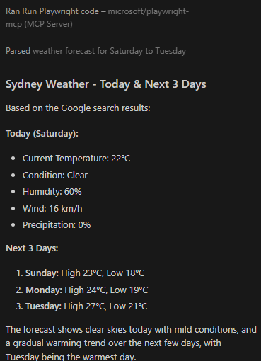

# MCP Server Connection Tests

**Developer:** Dwight Richard T. Mongaya  
**Date Tested:** March 14, 2026  
**Purpose:** Evidence that each MCP server is working correctly

---

## 1. Rolldice MCP Server

**Status:** ✅ Connected and Working

**Description:**
Rolldice MCP server provides dice rolling functionality for generating random numbers.

**Test Method:**
- Tool executed successfully in Claude Desktop
- Called the dice rolling tool and received random number output

**Result:**
Tool executed without errors and returned expected output format.

**Evidence:**

**Date Tested:** March 14, 2026

---

## 2. Additional MCP Servers

---

**Last Updated:** March 14, 2026
